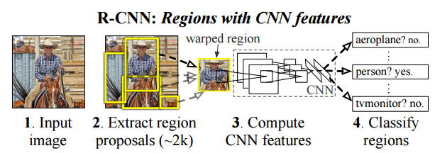
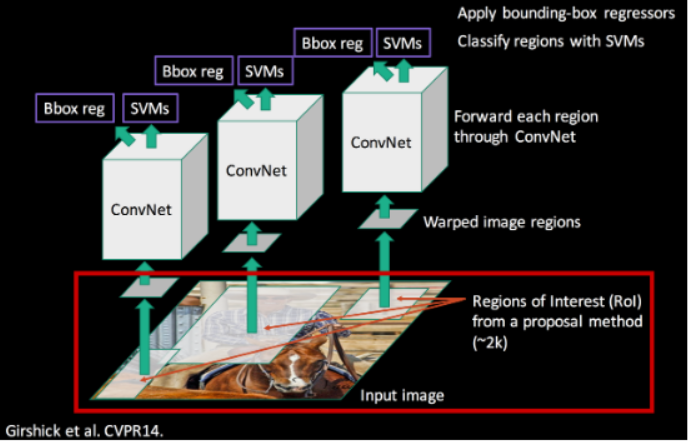
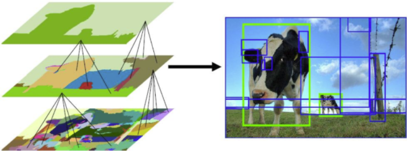
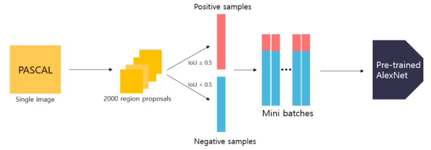
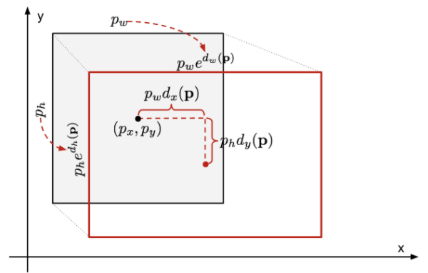

# R-CNN

# **Rich feature hierarchies for accurate object detection and semantic segmentation**

Girshick, Ross, et al. "Rich feature hierarchies for accurate object detection and semantic segmentation." *Proceedings of the IEEE conference on computer vision and pattern recognition*. 2014.

# 1. Back ground

- R-CNN이 등장하기 전 HOG와 SHIFT를 활용한 object detection 성능은 몇 년 동안 정체되어 있었다. (PASCAL VOC 2010-2012)
    - HOG & SHIFT → blockwise orientation histogram
- 2012년 LeCun의 AlexNet의 등장으로 ImageNet Classification에서 CNN이 큰 성능을 발휘한 것을 시작으로 CNN에 대한 많은 연구가 이루어짐.
- R-CNN은 Object detection 모델에서 처음으로 CNN을 이용하여 두각을 나타낸 모델
- R-CNN : Region proposal + CNN
- PASCAL VOC2012 데이터 셋에 대해 mAP 53.3%에 달성 (기존 방법보다 상대적으로 30% 더 높다.)

## main issue

(1) object detection with deep network

(2)  매우 적은 양의 label이 된 detection data로 높은 수용량을 가지는 model을 훈련시켜야한다.

(1)

Object detection은 classification과 달리 이미지에서 object를 localizing 해야한다.

**Localization의 3가지 접근 방법**

1. regression
2. sliding-window detector
3. region proposal

→ 본 논문에서는 region proposal 방법을 채택

(2)

전통적인 방법은 Unsupervised pre-training을 하고 supervised fine tuning을 하는 방식

본 논문에서는, ILVRC 분류작업 데이터 셋으로 supervised pre-training을 하고 object detection을 위한 작은 데이터 셋(PASCAL)으로 supervised fine tuning을 하는 방식으로 성능을 높임.

# 2. Object detection with R-CNN

## 2.1 Module design

R-CNN system은 3 modules로 구성되어 있다.

1. 카테고리-독립적인 Region Proposal
2. 각 Region에서 고정된 길이의 feature vector를 추출하는 CNN
3. 클래스 분류로 Linear SVM 사용.

### Region Proposal

- category-independent region proposals를 위해 **Selective search algorithm** 을 사용해 각 이미지에서 2000 장의 후보 영역을 찾는다. [https://my-atlassian-site-391.atlassian.net/wiki/spaces/VS/pages/1027277475/Prior#Selective-search](https://my-atlassian-site-391.atlassian.net/wiki/spaces/VS/pages/1027277475/Prior#Selective-search)
    
    
    
1. 색상, 질감, 영역크기 등을 이용해 non-objective segmentation을 수행한다. 이 작업을 통해 좌측 제일 하단 그림과 같이 많은 small segmented areas들을 얻을 수 있다.
2. Bottom-up 방식으로 small segmented areas들을 합쳐서 더 큰 segmented areas들을 만든다.
3. (2)의 작업을 반복하여 최종적으로 2000개의 region proposal을 생성한다.

2000 장의 region proposals를 얻게 되면 warp를 통해 이미지를 $227\times227$ 로 사이즈를 통합시켜준다. (CNN의 Fully connected layer는 고정된 입력 크기를 요구함.)

### CNN

- R-CNN에서는 AlexNet 을 이용했다.
- 이때, classification dataset을 이용해 pre-trained된 AlexNet 구조를 이용한다. 이후 Domain-specific fine-tuning을 통해 CNN을 다시 학습시킨다. 이렇게 학습된 CNN은 region proposals 2000개의 각각의227x227 image를 입력받아 4096-dimensional feature vector를 추출한다.

- 2000장의 region proposals와 ground-truth box의 ***IoU(Intersection of Union)*** 을 비교하여 IoU가 0.5보다 큰 경우 positive samples, 0.5보다 작은 경우 negative samples로 나눈다. 이렇게 sample을 나눴을 때, ground truth만 positive sample로 정의할때 보다 30배 많은 학습데이터를 얻을 수 있다. 많은 데이터를 통해 overfitting을 방지한다. Positive sample는 객체가 포함되어 있는 sample을 의미하고, negative sample은 객체가 포함되지 않은 배경 sample을 의미한다. 이렇게 나눈 후 positive sample 32개 + negative sample 96개 = 128개의 이미지로 이루어진 하나의 미니 배치를 만든다.
- 이렇게 생성된 배치들을 이용해 fine-tuning을 진행한다. fine-tuning을 하기 위해서 기존의 pre-trained된 AlexNet의 마지막 softmax layer를 수정해서 N+1 way classification을 수행하게 한다. 이때, N은 R-CNN에서 사용하는 dataset의 객체들의 종류의 개수이고, 1을 더해준 이유는 배경인지 판단하기 위해서이다. SGD를 통해 N+1 way classification을 수행하면서 학습된 CNN 구조는 domain-specific fine-tuning을 이룬다.
- 마지막의 N+1 way classification을 위해 수정한 softmax layer는 R-CNN 모델 사용시 사용하지 않는다. 왜냐하면 softmax layer는 fine-tuning을 위해 사용한 것이고, 원래 R-CNN에서 CNN 구조의 목표는 4096-dimensional feature vector를 추출하는 것이기 때문이다

### Linear SVM

- 2000장의 region proposals에서 fine-tuning때와는 다르게 ground truth box만을 positive sample, IoU 값이 0.3보다 작은 것은 negative sample로 지정한다. 이때, IoU값이 0.3보다 큰 경우 무시한다. 이때 0.3은 gird search를 통해 찾은 값이다. 이후는 fine-tuning과 마찬가지로 positive sample 32개 + negative sample 96개 = 128개의 미니배치를 구성한 후 fine-tuning된 AlexNet에 입력하여 4096 dimensional feature vector를 추출한다. 추출된 벡터를 이용해 linear SVMs를 학습한다. SVM은 2진 분류를 수행하므로 분류하려는 객체의 종류만큼 SVM이 필요하다. 학습이 한 차례 끝난 후, ***hard negative mining*** 기법을 적용하여 재학습을 수행한다.
- R-CNN에서는 단순히 N-way softmax layer를 통해 분류를 진행하지 않고, SVMs를 이용해 분류를 한다. 이는 SVM을 사용했을 때 성능이 더 좋기 때문이다. 성능 차이의 이유를 논문의 저자들은 positive sample을 정의할 때 SVM을 학습시킬 때 더 엄밀하게 정의한다는 점과 SVM이 hard negative를 이용해 학습하기 때문이라고 서술했다.
- linear SVM에서는 output으로 class와 confidence score를 반환한다.

### Bounding Box Regressor

- selective search 알고리즘을 통해 얻은 객체의 위치는 부정확할 수 있다.
- 이런 문제를 해결하기 위해 객체의 위치를 조절해주는 Bounding box regression이 있다.

N개의 Training pair인 $\{(P^i, G^i)\}_{i=1, ..., N}$ 에 대해 $P^i = (P^i_x, P^i_y, P^i_w, P^i_h)$ 는 해당 region에 대한 추정값으로 각각은 region 중심의 x,y 좌표와 width, height를 나타내고, 이에 대응되게 $G^i = (G^i_x, G^i_y, G^i_w, G^i_h)$ 는 해당 region에 대한 ground truth이다.

$$
w_* = \underset{y}{argmin}\sum_i^N (t^i_* - \hat{w}^T_*\phi_5(P^i))^2 + \lambda\parallel\hat{w}_*\parallel^2
$$

위의 식을 최적의 $w_*$ 를 찾고 싶다.

$\hat{w}_*$ : 학습되는 가중치

$\phi_5(P^i)$: $P^i$ 에 해당하는 feature vector. 여기서는 fine-tuning 된 CNN의 output 

$\lambda$ : ridge regression 을 위한 상수

$t^i_*$ 는 아래 참고

$$
t_x = (G_x - P_x) /P_w \\ t_y = (G_y - P_y)/P_h \\ t_w = log(G_w/P_w) \\ t_h = log(G_h/P_h)
$$

위의 식을 통해 찾은 $w_*$ 를 이용해 $d_*$ 라는 transformation 함수를 정의할 수 있다.

즉 다음과 같이 정의할 수 있다.

$$
d_*(P) = w^T_*\phi_5(P)
$$

$$
\hat{G}_x = P_wd_x(P)+ P_x \\ \hat{G}_y = P_hd_y(P)+ P_y \\ \hat{G}_w = P_w exp(d_w(P)) \\ \hat{G}_h = P_h exp(d_h(P))
$$

위와 같은 training pair를 정의할 때, P는 ground truth와 IoU 값이 0.6 이상인 경우만 사용한다.

# 단점

- 이미지 한 장당 2000개의 region proposal을 추출하므로 학습 및 추론의 속도가 느리다.
- 3가지 모델을 사용하다보니 구조와 학습과정이 복잡하다. 또한 end-to-end 학습을 수행할 수 없다.