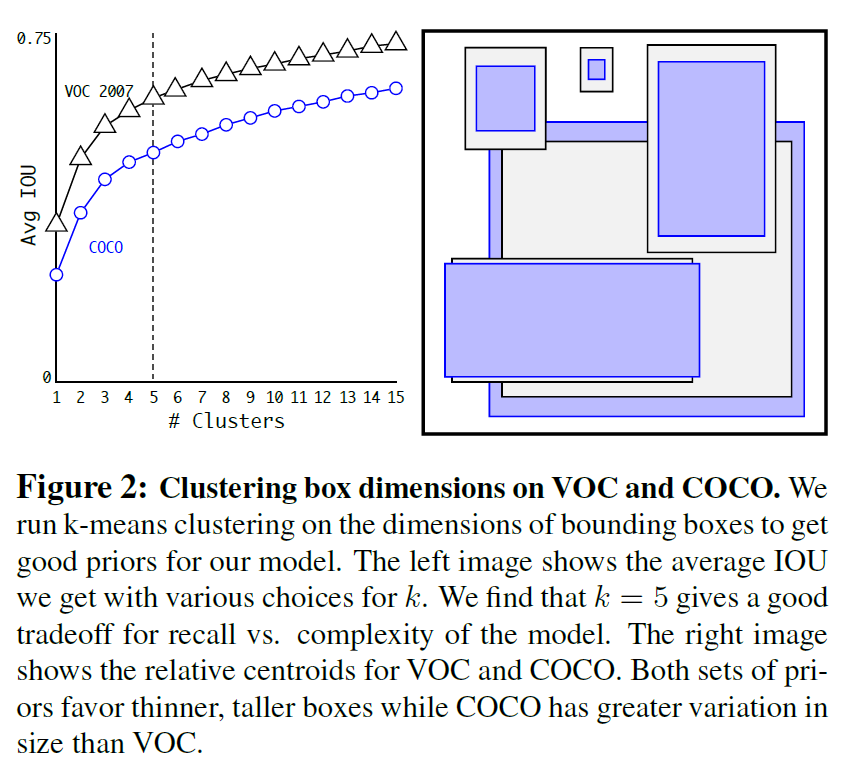
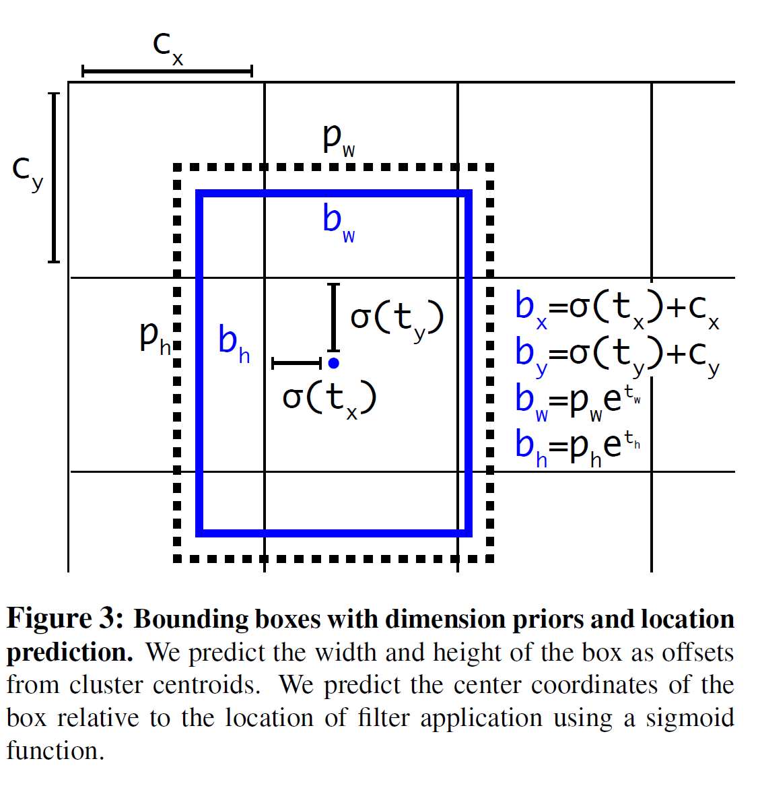

# YOLO v1, v2, v3

# YOLO v1

- Unified model for object detection
- One-stage object detector
- Reframe object detection as a regression problem
- Real-time object detector
- 추론시 이미지를 전역적으로 파악 → contextual information까지 학습하기 때문에 Background error가 낮음

## Method

1. 입력 이미지를 SxS grid로 나눈다. 객체의 중심이 grid cell에 맞아 떨어지면 그 grid cell은 객체를 탐지했다고 표기
2. 각각의 grid cell은 B개의 bounding box와 confidence score를 예측한다.
3. 각 Bounding box는 5개의 정보 (x, y), (w, h), confidence 를 갖음
4. 각 grid cell은 bounding box 이외에도 Class 확률을 예측
5. 최종 예측 값은 (SxS (B*5 +C)) 크기의 tensor

## Loss

Sum squared error 함수를 사용한다.

But,,

1. localization error 와 classification error 를 동등하게 가중치를 주는 것은 비이상적일 수 있다.
2. 객체가 존재하지 않은 grid cell이 많기 때문에 객체가 존재하는 cell의 confidence가 0을 향하게 하는 영향을 미칠 수 있다.

→ bounding box coordinate loss를 증가시키고, 객체가 존재하지 않은 box의 경우 confidence loss를 감소시킨다.

$\lambda_{coord} = 5, \lambda_{noobj} = 0.5$

$1^{obj}_i$: cell i에 객체가 존재하는가를 나타내는 indicator function.

YOLO는 각 grid cell에서 여러 개의 bounding box들을 예측한다. 학습시에 각 grid cell마다 한 개의 bounding box를 원하기 때문에, bounding boxes 중에서 ground truth와 가장 IoU가 높은 box만 선택해서 학습을 시킨다.

# YOLO v2

- Better : 정확도를 올리기 위한 방법
- Faster : detection 속도를 향상시키기 위한 방법
- Stronger : 더 많은 범위의 class를 예측하기 위한 방법

## Better

- Batch Normalization
- High Resolution Classifier
    - 이미지에 대해 Object Detection → Image Classification 모델 또한 큰 해상도에서 Pre-training 뒤 Fine tuning
- Convolution with Anchor Boxes
    - YOLO v1 : bounding box가 0~1 사이의 값을 가지도록 랜덤으로 설정한 뒤 학습을 통해 최적의 값을 찾아감.
    - Faster RCNN : 9개의 anchor box를 정의한 후 bounding box regression을 통해 x, y좌표와 aspect ratio(offset)을 조정
    - 좌표 대신 offset을 예측하는 문제가 보다 단순하고 네트워크가 학습하기 쉽다는 장점
    - → Region proposal 보다 이미지 당 상대적으로 적은 수의 bounding box를 예측하는 v1의 문제를 Anchor box를 통해 더 많은 수의 bounding box를 예측함으로써, 더 정확한 위치 예측과 Recall값이 상승
- Fine-Grained Feature 사용
- Multi-Scale Training

### Dimension Clusters

- 기존 Anchor box (Fast RCNN에서) : Aspect ratio를 사전에 미리 정의함 (hand-picked)
- Yolo v2 : train dataset에 K-means clustering을 통해 최적의 prior를 탐색한다.
    - 이때, 유클리디안 거리를 이용하는 표준적인 k-means를 사용하게 되면, 경계 박스의 크기에 비례해서 에러가 커진다.
    - IoU 를 distance metric으로 사용하여 k-means 클러스터링을 진행한다.

$$
d(box,centroid) = 1 - IOU(box, centroid)
$$

### Direct location prediction

앵커 박스를 이용하면 초기단계에서 모델이 불안정해지는 문제를 해결할 수 있다.

학습 불안정의 주요 원인은 학습 초기에 박스의 (x, y) 위치가 너무 랜덤하게 예측되기 때문이다.

- RCNN, Fast RCNN 과 같은 기존의 방법들은 아래의 수식과 같이 $t_x, t_y$ 를 이용해 bounding box의 x,y 좌표를 예측한다.

$$
x = (t_x * w_a) - x_a \\y = (t_y*h_a) - y_a
$$

→ $t_x$ 가 1이면 박스는 앵커박스의 가로 길이 만큼 오른쪽으로 이동하며 -1이면 왼쪽으로 이동.

→ 위 공식은 제약이 없기 때문에 어느 위치(grid cell)에서 Bounding box를 예측하는 가에 상관 없이 앵커박스 위치가 영상 어디에도 나타날 수 있다.

→ 초기값을 랜덤으로 하게 될 경우, 어느 정도 정확한 오프셋을 예측하기까지 오랜 시간이 걸린다.

- YOLO는 x, y의 위치를 **grid cell 내부에만 있도록** 제한한다.
- 해당 grid cell의 이미지 좌상단 모서리로부터 offset을 $(c_x,c_y)$ 이라 하고, 사전 정의된 앵커박스의 width, height를 $p_w, p_h$ 라고 한다면, 네트워크는 각 bounding box마다  5 개의 값을 예측한다.
- $t_x, t_y, t_w, t_h, t_o$

$b_x, b_y, b_w, b_h$: bounding box의 (x, y)좌표와 width, height

$\sigma$: logistic activate function (sigmoid)

- sigmoid function 을 통해  의 범위가 0~1로 바뀌기 때문에, predicted bounding box의 중심 좌표가 cell 영역에 제한될 수 있다.

## Faster

- Darknet-19 를 사용

## Stronger

생략

# YOLO v3

- Backbone architecture : Darknet-19 → Darknet-53
- 3개의 scale을 고려하여 객체 검출 수행
- 작은 크기의 객체 검출 성능 향상
    - YOLO v2(AP_S: 5.0) → YOLO v3(AP_S: 18.3)
- 더 많은 개수의 anchor box를 이용
    - YOLO v2 (5개) → YOLO v3 (9개)
    - 3개의 scale에서 각 scale 마다 3개의 anchor box
- 많은 수의 bounding box 사용
    - YOLO v2 (845개) → YOLO v3 (10,647 개)
- Multi-label 분류를 고려하여 loss function 변경
    - Class prediction에서 soft-max 함수가 아닌, class 별로 binary cross-entropy 함수 적용

