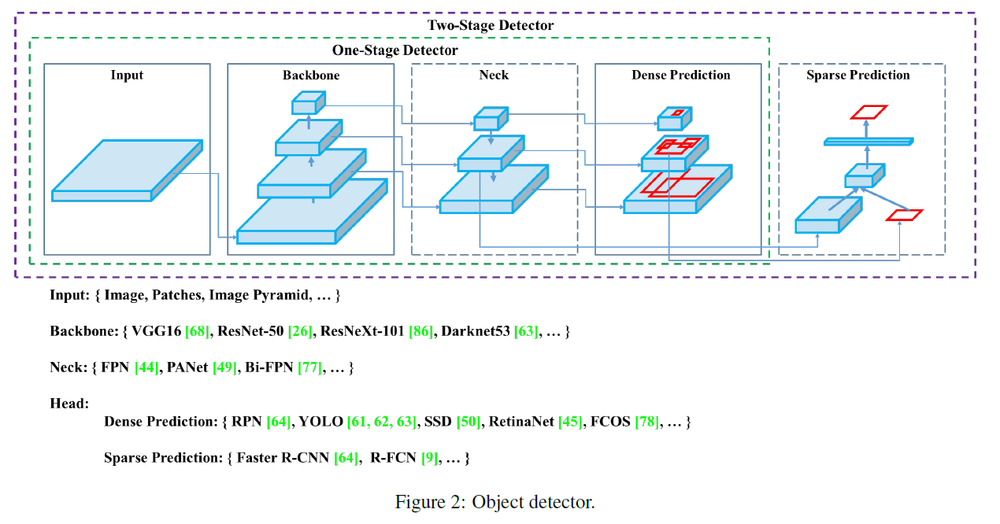

# YOLO v4

# YOLO v4 :Optimal Spped and Accuracy of Object Detection

# Intro

- 대부분의 CNN 기반 object detector들은 recommendation system에서만 사용할 수 있다.
    
    ex) 자유 주차 추천 시스템 ← 느리게 실행되지만, 정확함.
    
    차량 충돌 경고 시스템 ← 빠르지만 비교적 부정확함.
    
- 최신 Neural Networks들은 높은 정확도를 가지지만, 낮은 FPS(실시간 x)와 너무 큰 Mini-batch-size로 인해 학습하는데 많은 수의 GPU들이 필요하다는 단점이 있다.
- YOLO v4는 real-time에 작동하며, 통상적인 GPU 하나로 학습할 수 있는 CNN.

### Contribution

1. Efficient and powerful object detection model
2. Bag-of-Freebies 와 Bag-of-Specials의 영향력 증명
3. 최신 기법들(CBN, PAN, SAM 등..)을 변형하고 더 효율적으로 만들고 단일 GPU 학습에 알맞게 변경.

### YOLO v4가 사용한 최신기법

- WRC (Weighted-Residual-Connections)
- CSP (Cross-Stage-Partial Connections)
- CmBN (Cross mini batch normalization)
- SAT (self adversarial-trining
- Mish Activation
- DropBolock Regularization
- CIoU LOSS

요약하자면 1개의 GPU를 사용하는 일반적인 학습환경에서 BOF, BOS 기법을 적용하여 효율적이고 강력한 Object Detection을 제작했다는 이야기다.

YOLO v4는 FPS가 높으면서(real time) 비교적 AP가 높다.

# Related Work

## 2.1 Object detection models

object detection model의 **일반적인 구조**(backbone, neck, head)와 **종류**(1-stage, 2-stage)에 대해 소개한다.

최신 detector는 주로 Backbone과 Head라는 두 부분으로 구성된다.

### Backbone

- 입력 이미지를 feature map으로 변형시켜주는 부분.
- 네트워크의 구조
- 일반적으로 ImageNet 데이터 셋으로 pre-trained 시킨다.
    
    GPU platform : VGG, ResNet, ResNeXt, DenseNet 등등
    
    CPU platform : SqueezeNet, MobileNet, ShuffleNet 등등
    

### Head

- feature map을 전달받아 object detection의 작업을 수행하는 곳.
- Bounding box와 class를 예측하는 역할을 한다.
- 크게 one-stage object detector와 two-stage object detector로 나눌 수 있다.
    
    **Localization과 class classification이 따로 이루어지면 2-stage, 한꺼번에 이루어지면 1-stage라고 할 수 있다.**
    
    **2-stage**
    
    anchor based : R-CNN, Fast RCNN, Faster RCNN, Mask RCNN, R-FCN, Libra R-CNN 등등
    
    anchor free : RedPoints
    
    **1-stage**
    
    anchor based : YOLO, SSD, RetinaNet 등등
    
    anchor free : CenterNet, CornerNet, FCOS 등등
    

### Neck

- Backbone과 Head 사이에서, Featuremap refinement(정제), reconfiguration(재구성)하는 역할을 한다.
    
    Feature Pyramid Network(FPN), Path Aggregation Network(PAN), BiFPN, NAS-FPN등등..
    

### Etc

- 이 외에도 몇몇 연구들은 object detection 을 위한 새로운 백본(DetNet, DetNAS)이나 새로운 전체 모델(SpineNet, HitDetector) 을 만드는데 중점을 두기도 하였다.
    
    
    

## 2.2 Bag Of Freebies (BOF)

- Inference cost의 변화 없이 성능 향상을 꾀할 수 있는 딥러닝 기법들이다.
    - **Data augumentation**
        - Photometric distortion : adjust Brightness, Contrast, Hue, Saturation, Noise of image
        - Geometric distortion : Random scaling, Cropping, Flipping, Rotating
        - Simulating Occlusion : Random erase, CutOut
        - Using multiple images together : MixUp, CutMix
        - style transfer GAN
    - **Feature maps**
        
        DropOut, DropConnect, DropBlock
        
    - **Semantic Distribution Bias**  
    → 기존 CrossEntropy에 
    라는 factor가 하나 포함되어있고, 이 factor의 scale은 
    로 조절한다. 이로인해 쉬운 예제의 경우 손실에 기여도를 낮출 수 있다.
        
        데이터 셋에 특정 라벨이 많거나 하는 경우에 대한 불균형을 해결하기 위한 방법
        
        - Hard Negative Example Mining
        
        → Hard Negative란 Negative를 Positive라고 예측하기 쉬운 데이터이다. Hard Negative Mining이란 Hard Negative 데이터를 모아서 원래 데이터에 추가해서 학습하는 방법이다. 이로인해 False Positive 오류에 강건해진다.
        
        But,, **1-stage detector** 에는 적절하지 않다.
        
        - Focal Loss
        
        $Crossentropy = -log(p_t)$: 분류하기 쉬운 샘플의 경우 학습에 기여도는 낮기 때문에 비효율적이다. 이러한 문제를 해결하기 위한 새로운 손실 함수다.
        
        $$
        FocalLoss = -(1-p_t)^\gamma log(p_t), \gamma \ge 0
        $$
        
        - label smoothing
            
            : hard label을 soft label로 변환하여서 학습
            
            즉, 데이터셋 라벨링의 실수 가능성을 포함하는 방법
            
            ex) [고양이 : 1, 개 :0] →[고양이 : 0.9, 개 : 0.1]
            
    - **Bounding Box Regression loss**
        - Objective Function: 일반적으로 목적함수로 MSE 목적함수를 사용하였다. (BBox의 중심점과 높이,넓이 혹은 offset들을 직접적으로 회귀하는..)IOU loss
            
            :Scale Invariant하다는 장점이 있다.
            
            - GIOU (Generalized Intersection over Union)
            - CIOU (Complete Intersection over Union)
            - DIOU (Distance Intersection over Union)

## 2.3 Bag Of Specials (BOS)

- Inference cost가 조금 상승하지만, 성능 향상이 되는 딥러닝 기법들이다.
    - **Enhance receptive field** (SPP, ASPP, RFB)
        - SPP (Spatial Pyramid Pooling)
            - SPM (Spatial Pyramid Matching)에 의해 개발된 모듈.
            - SPM 방법은 특징 맵을 동일한 $d\times d$ 블록으로 나눈 뒤, spatial pyramid를 형성하고 bag-of-word를 사용해 feature를 추출한다.
            - SPP는 딥러닝에 최적화 하기 위해 CNN와 SPM을 결합하고 bag-of-word 대신 maxpooling을 사용한다.
                
                
                
        - ASPP (Atrous Spatial Pyramid Pooling)
        - RFB(Receptive Field Bolock Net)
    - **Attention Module**
        
        Attention module이란 학습을 하면서 어느부분이 중요한지 자동적으로 강조하게 학습시키게 하는 모듈을 말한다.
        
        - SE (Squeeze-and-Excitation)
            - 약 2% 연산량이 증가하지만 1% 정확도가 향상된다.
            - 하지만 GPU에서 추론시간이 10% 증가한다.
                
                
                
        - SAM (Spatial Attention Module)
            - 0.1% 연산량이 증가하고 0.5% 정확도가 향상된다. GPU 추론시간에 영향이 없다.
                
                
                
    - **feature integration** (skip-connection, hyper column, Bi-FPN)
    - **최적의 activation function** (P-ReLU, ReLU6, Mish)

작성중…