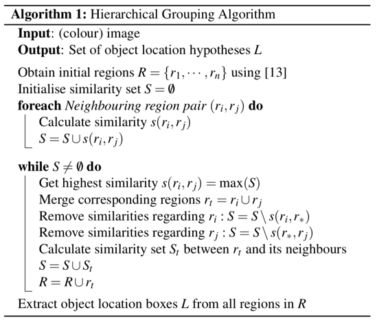

# Prior knowledge

# Selective search

- Bounding boxes들을 찾아주는 super pixel기반 hierarchical grouping algorithm
- Bottom-up 방식


## 학습방법

**Definition**

- R: 선택된 region 후보들 $\{r_1, r_2, ...\}$
- S: region 들의 유사도 집합 $\{s(r_i, r_j), ...\}$



1. $r_1, r_2, ..., r_n$ 들을 초기화
2. 가장 유사성 높은 $s(r_i, r_j)$ 을 선택
3. 선택된 $r_i, r_j$ 의 영역을 $r_t$ 로 합침
4. 유사성 집합 *S* 에서 이미 합쳐진 $s(r_i, r_*), s(r_*, r_j)$ 을 제거
5. 합쳐진 $r_t$ 와 나머지 region들의 새로운 유사성 집합 $(S_t)$ 를 계산
6. 새로운 유사성 집합 $S_t$, 합쳐진 region $(r_t)$ 을 원래 집합 $(S,R)$
에 포함시킴
7. 하나의 region이 될때까지 반복

## Region similarity

Selective search의 유사성은 [0, 1] 사이로 정규화된 4가지 요소(color, texture, size, fill)들의 가중합으로 계산됨

$$
S(r_i, r_j) = a_1s_{color}(r_i,r_j) + a_2s_{texture}(r_i, r_j) + a_3s_{size}(r_i,r_j) + a_4s_{fill}(r_i,r_j)\\A = {a_1,a_2,a_3,a_4}, 0\leq a \leq 1
$$

### Color: 이미지 색깔

- 각 컬러 채널을 25개의 bin으로 설정
- 각 region마다 컬러 히스토그램 생성

$$
C_i = c_i^1, ..., c_i^n
$$

- 차원 수 $n = 75$ (25 RGB)
- *L1* norm 정규화 [0,1]
- 인접한 regions의 교집합을 유사도로 측정

$$
s_{color}(r_i,r_j) = \sum_{k=1}^{n}min(c_i^k, c_j^k)
$$

- 유사성 척도의 min function은 두 히스토그램의 교집함을 나타냄


- 합쳐진 region $(r_t)$ 
의  $c_t$는 초기에 생성된  $C_i = c_i^1, ...,c_i^n$을 이용하여 업데이트함(efficiently propagated)

$$
C_t = {{size(r_i)\times C_i +size(r_j)\times C_j}\over{size(r_i) + size(r_j)}}
$$

$$
r_t = size(r_i) + size(r_j)
$$

### Texture: 주변 pixel값들의 변화량

Reference: [https://donghwa-kim.github.io/hog.html](https://donghwa-kim.github.io/hog.html)

- $\sigma = 1$ 인 8방향의 가우시안 미분을 적용
- 10개의 bin으로 히스토그램 도출

$$
T_i = t_i^1, ..., t_i^n
$$

- *L1* norm 정규화 [0, 1]
- 80차원(8방향 * 10차원 bin)의 벡터로 인접한 region들의 유사성을 평가(RGB의 경우 240차원)

$$
s_{texture}(r_i,r_j) = \sum_{k=1}^{n}(t_i^k,t_j^k)
$$

### Size: Region들의 사이즈

- 사이즈가 작을 수록 유사도가 높음

$$
s_{size}(r_i,r_j) = 1 - {{size(r_i) + size(r_j)}\over{size(im)}}
$$

- $im$ 은 source image를 나타냄

### Fill: Candidate bounding box 크기와 차이

- Candidate bounding box와 region들의 사이즈 차이가 적을수록 유사도가 높음

$$
s_{fill}(r_i,r_j) = 1-{{size(BB_{ij})-size(r_i)-size(r_j)}\over{size(im)}}
$$

- $im$ 은 source image를 나타냄

---

# Intersection over union (IOU)

→ Object detector의 정확도를 측정하는데 이용되는 평가 지표

IOU를 적용하기 위해서는 두 가지가 필요함

1. Ground-truth bounding boxes (test set에서 object 위치를 labeling 한것)
2. Predicted bounding boxes (model이 예측한 object 위치)


```python
import torch

def intersection_over_union(boxes_preds, boxes_labels, box_format='midpoint'):

    # x1, y1 : upper left
    # x2, y2 : lower right

    if box_format=='midpoint':
        box1_x1 = boxes_preds[...,0:1] - boxes_preds[...,2:3]/2
        box1_y1 = boxes_preds[...,1:2] - boxes_preds[...,3:4]/2
        box1_x2 = boxes_preds[...,0:1] + boxes_preds[...,2:3]/2
        box1_y2 = boxes_preds[...,1:2] + boxes_preds[...,3:4]/2

        box2_x1 = boxes_labels[...,0:1] - boxes_labels[...,2:3]/2
        box2_y1 = boxes_labels[...,1:2] - boxes_labels[...,3:4]/2
        box2_x2 = boxes_labels[...,0:1] + boxes_labels[...,2:3]/2
        box2_y2 = boxes_labels[...,1:2] + boxes_labels[...,3:4]/2

    if box_format=='corners':
        box1_x1 = boxes_preds[..., 0:1] # (N,1)
        box1_y1 = boxes_preds[..., 1:2]
        box1_x2 = boxes_preds[..., 2:3]
        box1_y2 = boxes_preds[..., 3:4]
        box2_x1 = boxes_labels[..., 0:1]
        box2_y1 = boxes_labels[..., 1:2]
        box2_x2 = boxes_labels[..., 2:3]
        box2_y2 = boxes_labels[..., 3:4]

    x1 = torch.max(box1_x1, box2_x1)
    y1 = torch.max(box1_y1, box2_y1)
    x2 = torch.min(box1_x2, box2_x2)
    y2 = torch.min(box1_y2, box2_y2)

    intersection = (x2-x1).clamp(0) * (y2-y1).clamp(0)

    box1_area = abs((box1_x2 - box1_x1) * (box1_y2 - box1_y1))
    box2_area = abs((box2_x2 - box2_x1) * (box2_y2 - box2_y1))

    return intersection/(box1_area + box2_area - intersection + 1e-6)

```

---

# Non-maximum suppression

[YOLO slide](https://docs.google.com/presentation/d/1aeRvtKG21KHdD5lg6Hgyhx5rPq_ZOsGjG5rJ1HP7BbA/pub?start=false&loop=false&delayms=3000&slide=id.g137784ab86_4_4740)

- 일반적으로 영상에서 edge를 찾기위한 NMS는 현재 픽셀과 주변의 픽셀과 비교했을 때 최대값인 경우 그대로 놔두고, 아닐 경우(비 최대) 억제(제거)하는 것이다.
- 딥러닝을 이용한 object detection에서는 겹치는 bounding box 제거를 위해 사용


1. 동일한 클래스의 bounding box를 confidence 기준 내림차순 정렬
2. 가장 confidence가 높은 bounding box와 IOU가 일정 이상인 bounding box는 동일한 물체를 detect했다고 판단하여 지움 (보통 50% 이상)

```python
import torch
from IoU import intersection_over_union

def nms(bboxes, iou_threshold, threshold, box_format = 'corners'):

    # bboxes가 list인지 확인
    assert type(bboxes) == list

    # box 점수가 threshold보다 높은 것을 선별
    # box shape은 [class, score, x1, y1, x2, y2]
    bboxes = [box for box in bboxes if box[1]>threshold]
    # Score 내림차순으로 정렬
    bboxes = sorted(bboxes, key=lambda x: x[1], reverse=True)
    bboxes_after_nms = []

    # bboxes가 모두 제거될때 까지 반복
    while bboxes:
        chosen_box = bboxes.pop(0)

        # box 가 선택된 box와의 iou가 임계치보다 낮거나
        # class가 다르다면 bboxes에 남기고, 그 이외는 다 없앤다.
        bboxes = [box for box in bboxes if box[0] !=chosen_box[0]
                or intersection_over_union(torch.tensor(chosen_box[2:]),
											torch.tensor(box[2:]),
											box_format='midpoint')<iou_threshold]

        bboxes_after_nms.append(chosen_box)

    return bboxes_after_nms
```

---