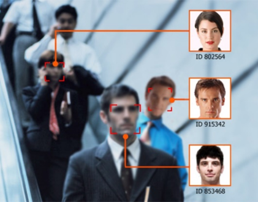
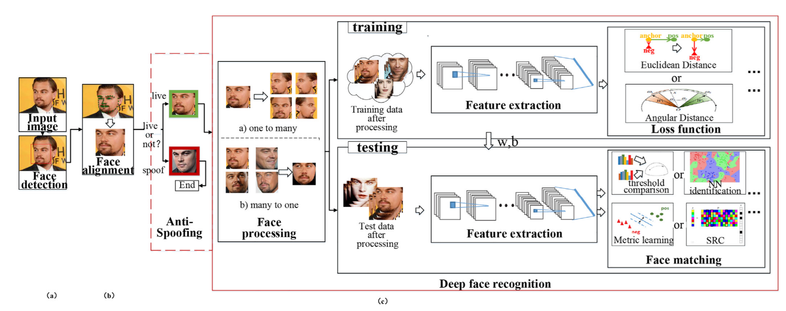
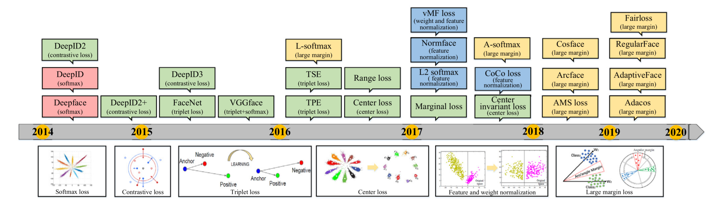
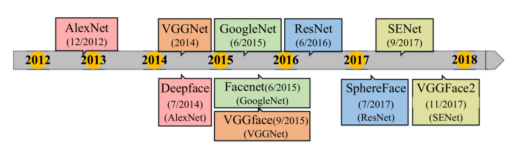

# Object recognition

# 성능지표

- Accuracy (%)

# 예시

→ 얼굴을 검출하고 DB에 저장된 얼굴 정보와 비교하여 누구인지 식별

# 검증(verification) vs 식별(identification)

- 검증 → one-to-one
    - 입력된 영상 (the probe)과 다른 영상 (the gallery) 내 객체의 동일성 검증
- 식별 → one-to-many
    - 영상 내 객체 (the probe)가 DB에 저장된 (the gallery) 어떤 객체와 가장 유사한지 식별

---

# Research trends

Face Detector → Facial landmark Detector → Face Recognition module

- 입력 이미지(the probe)에서 객체를 검출
- 검출된 객체를 학습된 네트워크를 통해 특징 벡터 추출
- 추출된 특징 벡터와 DB에 저장된 객체(the gallery)의 특징 벡터 간의 유사도를 계산하여 동일 객체인지 검증 및 식별

## Evolution of discriminative loss function

- Deep learning 기반 recognition 초기 연구에는 object classification 처럼 cross-entropy 기반의 **softmax loss** 함수를 사용
- 특징 벡터간 차별적인 특징을 학습하기에는 softmax loss로 충분하지 않음 → 새로운 loss 함수를 탐색하기 시작

### Euclidean-distance based

- Constrative loss
- Triplet loss
- Center loss

### Angular/cosine-margin-based loss ('17~)

Anglular/cosine-margin-based loss는 clean dataset에 더 좋은 성능을 내지만, center loss 와 softmax loss에 비해 noise에 더 취약하다 [[3](about:blank#)]

- L-softmax
- A-softmax
- Cosface
- Arcface
- AMS loss
- Fairloss
- AdaptiveFace

### Softmax loss and its variation ('17~)

Loss 함수에서 feature들과 weight 들을 normalize 하는방법

- L2 softmax
- Ring loss
- COCO loss
- vMF loss (von Mises-Fisher distribution)

## Evolution of network architectures

### Mainstream architectures

일반적으로 Object classification에서 사용되는 네트워크 구조를 따른다.

### Adaptive-architecture networks

- Neural Architecture Search (NAS) [[4](about:blank#Reference)]
    - 강화학습을 통해 특정 Task의 최적의 네트워크 구조를 디자인 (AI를 만드는 AI?)
- NAS를 Face recognition과 통합 [[5](about:blank#Reference)]

### Etc

얼굴의 서로 다른 patch들을 입력으로 받는 multi-input network, 사람의 ID를 식별할 뿐 아니라 포즈, 조명, 나이, 감정 등을 동시에 추정하는 multi-task network 등이 연구되었음.

opinion : recognition은 backbone network 보다는 차별적인 feature vector를 생성할 수 있는 loss 함수 중심의 연구가 많다.

---

# Methods

- FaceNet ('15) [[6](Reference)]
- MTCNN ('16) [[10](about:blank#Reference)]

# State-of-the-Art

- FaceNet+Adaptive Threshold ('19) [[9](about:blank#Reference)]
- Circle Loss ('20) [[7](about:blank#Reference)]
- Prodpoly ('20) [[8](about:blank#Reference)]

---

# Reference

[1] *Wang, M., & Deng, W, “Deep face recognition: A survey”, Neurocomputing, 429: 215-244, 2021. [[link](https://www.sciencedirect.com/science/article/abs/pii/S0925231220316945?casa_token=A02L5NhorrMAAAAA:mIwNugWm9gKYPTLjxK8v2sLVNyanfxj82QrsMdz1sI5FeczxEaofQCJfCQ2z1-kmVPLEnPa7)]*

[2] *Huang, Gary B., et al. "Labeled faces in the wild: A database forstudying face recognition in unconstrained environments." Workshop on faces in'Real-Life'Images: detection, alignment, and recognition. 2008.* [[link](https://hal.inria.fr/inria-00321923/)] [[site link](http://vis-www.cs.umass.edu/lfw/)]

[3] *Wang, Fei, et al. "The devil of face recognition is in the noise." Proceedings of the European Conference on Computer Vision (ECCV). 2018. [[link](https://scholar.google.com/scholar_lookup?title=The%20devil%20of%20face%20recognition%20is%20in%20the%20noise&author=F.%20Wang&publication_year=September%202018)]*

[4] *Zoph, Barret, and Quoc V. Le. "Neural architecture search with reinforcement learning." arXiv preprint arXiv:1611.01578 (2016). [[link](https://arxiv.org/abs/1611.01578)]*

[5] *Zhu, Ning, Zekuan Yu, and Caixia Kou, "A new deep neural architecture search pipeline for face recognition." IEEE Access 8 (2020): 91303-91310. [[link](https://ieeexplore.ieee.org/document/9091879)]*

[6] *F. Schroff, D. Kalenichenko, and J. Philbin, ‘‘Facenet: A unified embedding for face recognition and clustering,” in Proceedings of the IEEE conference on computer vision and pattern recognition, pp. 815–823, 2015. [[link](https://www.cv-foundation.org/openaccess/content_cvpr_2015/html/Schroff_FaceNet_A_Unified_2015_CVPR_paper.html)]*

[7] *Sun, Yifan, et al. "Circle loss: A unified perspective of pair similarity optimization." Proceedings of the IEEE/CVF Conference on Computer Vision and Pattern Recognition. 2020.[[link](https://openaccess.thecvf.com/content_CVPR_2020/html/Sun_Circle_Loss_A_Unified_Perspective_of_Pair_Similarity_Optimization_CVPR_2020_paper.html)]*

[8] *Chrysos, Grigorios G., et al. "P-nets: Deep polynomial neural networks." Proceedings of the IEEE/CVF Conference on Computer Vision and Pattern Recognition. 2020. [[link](https://openaccess.thecvf.com/content_CVPR_2020/html/Chrysos_P-nets_Deep_Polynomial_Neural_Networks_CVPR_2020_paper.html)] [[code](https://github.com/grigorisg9gr/polynomial_nets)]*

[9] *Chou, Hsin-Rung, et al. "Data-specific adaptive threshold for face recognition and authentication." 2019 IEEE Conference on Multimedia Information Processing and Retrieval (MIPR). IEEE, 2019. [[link](https://ieeexplore.ieee.org/abstract/document/8695322?casa_token=qJa0Ur26l6sAAAAA:uKki0hc6EYcYHbvz0t-uNA0zppSrYU5cMycuCYEtHNBqoCzY8mmrE_JxfBocHr2cMpDk-gY)] [[code](https://github.com/ivclab/Online-Face-Recognition-and-Authentication)]*

[10] *Zhang, Kaipeng, et al. "Joint face detection and alignment using multitask cascaded convolutional networks." IEEE signal processing letters 23.10 : 1499-1503, 2016. [[link](https://ieeexplore.ieee.org/abstract/document/7553523?casa_token=YnK0xWzupJQAAAAA:qtls0dKBjlcCECEcJ5vDNPKSMIWWpOYe9wD9ManrBntFkxbloAZ4sqHB04FEG81LeyP9Ghg)][[code](https://github.com/ipazc/mtcnn)]*