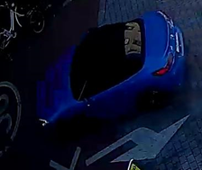
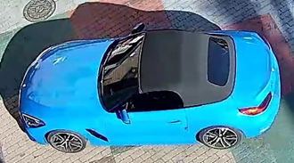
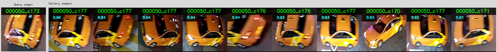
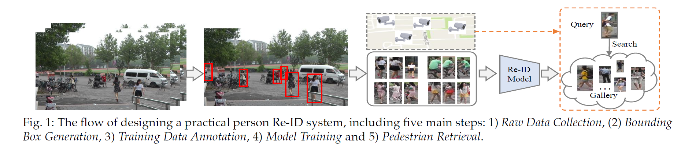
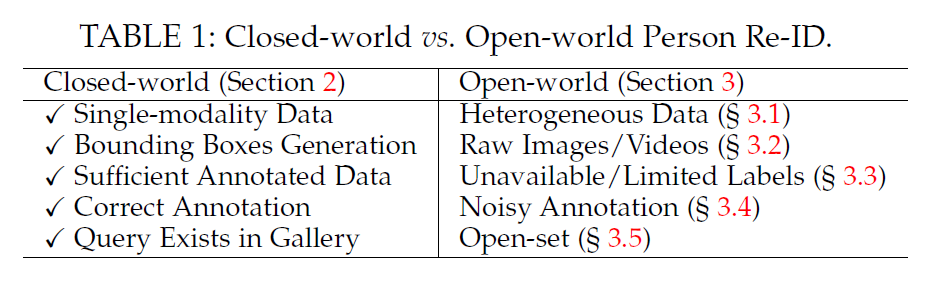
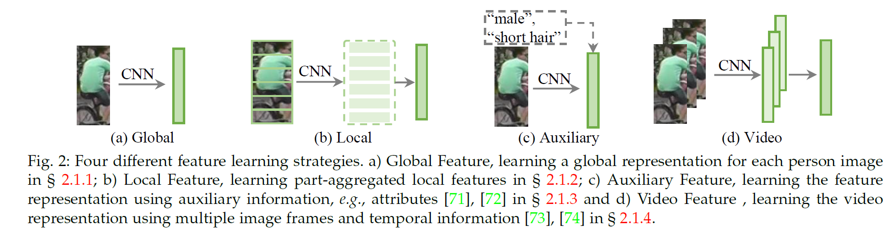
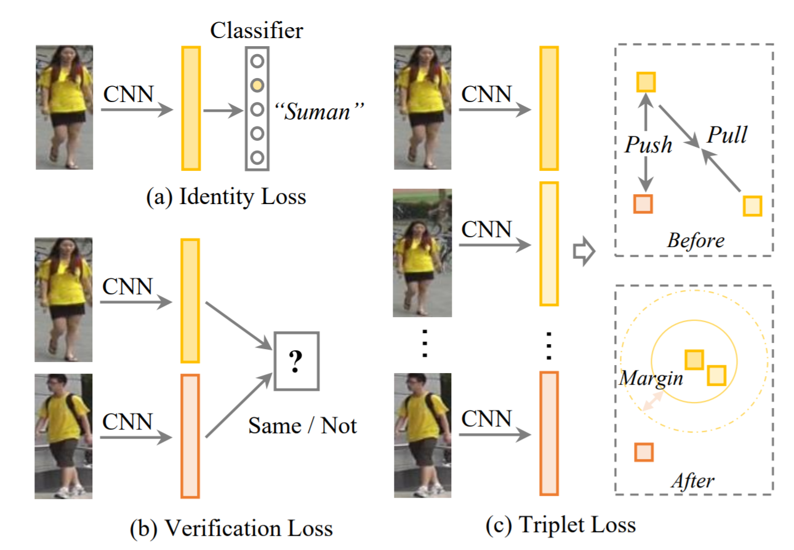
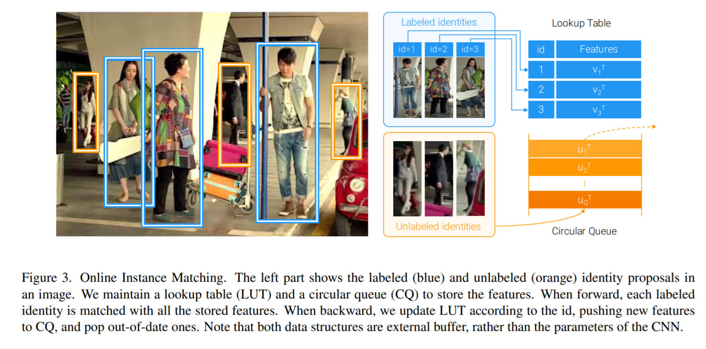
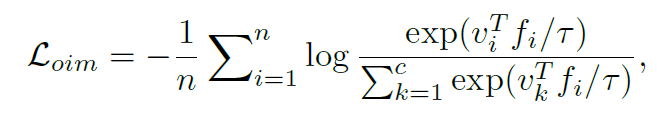

# Object re-identification

# 성능지표

|성능지표| 설명|
|---|---|
|mAP (%)| Mean average precision|
|CMC-k (%)| Cumulative matching characteriscics Correct match가 k번째 ranking 안에 포함되는 비율  -> 오직 하나의 GT가 존재할 때에만 적합 e.g. Rank-1 accuracy (%)|
|mINP|Mean inverse negative penalty|

# 예시

---

> Person Re-identification 과 Vehicle Re-identification 구분
> 

# Person Re-identification

# Re-identification challenging point

- presence of different viewpoints
- varying low-image resolutions
- illumination chagnes
- unconstrained poses
- occlusions
- heterogeneous modalities
- complex camera environments
- background clutter
- unreliable bounding box generations
- dynamic updated camera network
- large scale gallery with efficient retrieval
- group uncertainty
- significant domain shift
- unseen testing scenarios
- incremental model updating
- changing cloths

# 일반적인 Re-identification 시스템

1. Raw Data Collection
    1. 감시 카메라로부터 영상 받아옴
2. Bounding Box Generation
    1. 사람이 포함된 이미지로부터 바운딩 박스 생성
    2. 주로 detection, tracking 알고리즘 이용
3. Training Data Annotation
    1. 주로 도메인이 변경될 때마다 새롭게 annotation을 해야됨
4. Model Training
    1. Re-ID 수행 → 같은 label data를 묶고, 전체를 gallery에 저장
5. Pedestrian Retrieval
    1. Re-ID 모델을 이용해 query 이미지의 feature representation (feature vector) 추출
    2. query-to-gallery similarity를 비교해서 내림차순으로 나열된 retrieved ranking list 생성
    3. 이 때, retrieval performance를 향상시키기 위한, ranking optimization이 수행되기도 함

# Close-world vs Open-world Person Re-ID

Re-identification 연구를 크게 closed-world, open-world 두 가지 유형으로 나눌 수 있다.

1 ) Single-modality vs. Heterogeneous Data

- closed-world : 영상에 있는 사람들이 single-modality라고 가정
- open-world : heterogeneous data들도 포함될 수 있음
    - e. g. infrared images, depth images, text description

2 ) Bounding Box Generation vs. Raw Images/Videos

- closed-world : 사람에 대한 바운딩 박스가 이미 생성되었다고 가정하고 Re-ID를 수행
- open-world : detection+boudnig box generation + Re-ID 모든 과정을 end-to-end 로 수행

3 ) Sufficient Annotated Data vs. Unavailable/Limited Labels

- closed-world : Re-ID 모델을 학습하기 위한 충분한 annotated data가 있다고 가정
- open-world
    - 새로운 환경마다 label annotation을 해주는 것은 사실상 불가능
    - 실생활에서 limited label을 가지고 classification을 수행할 수 없음
    - unsupervised / semi-supervised Re-ID

4 ) Correct Annotation vs. Noisy Annotation

- closed-world : clean labels. 모두 정확한 바운딩박스가 주어진다고 가정
- open-world
    - annotation noise
    - 부정확한 detection/ tracking 결과
    - noise robust한 연구 필요

5 ) Query Exists in Gallery vs. Open-set

- closed-world : 모든 query person이 gallery에 존재한다는 가정
- open-world
    - query person이 gallery에 없을 수도 있음.
    - 검색 (retrieval)뿐만 아니라 verification (존재 유무 확인 및 검색)이 필요

# Closed-world person Re-identification

Closed-world Assumption을 따름

## Feature Representation Learning

이미 detected  된 사람의 Feature representation 을 추출하는 방법에 대해 다룸

크게 4 가지 방법으로 나눌 수 있음

### 1. Global Feature Representation Learning

Box 전체를 이용해서 global feature를 추출

- PRW ('17) [[2](about:blank#Reference)]
    - ID-discriminative Embedding (IDE) model
    - 학습 과정을 multi-class classification 문제로 설계하였음

Feature Representation 성능을 향상하기 위해 **Attention 정보**를 활용하기도 함

- pixel level attention
- attention across multiple person images

### 2. Local Feature Representation Learning

human parsing이나 pose estimation을 이용해 사람의 각 부분들의 특징들을 학습

misalignment에 강건하게 해줌

occlusion이나 background clutter에 취약함

### 3. Auxiliary Feature Representation Learning

추가 데이터를 활용한 feature learning

- Semantic Attributes
    - male, short hair, red hat 과 같은 추가 정보를 이용
- Viewpoint Information
- Domain Information
    - 다른 카메라 이미지를 다른 도메인이라고 여기고, 최종적으로 globally optimal feature를 얻음
- GAN Generation
- Data Augmentation

### 4. Video Feature Representation Learning

Video 시퀀스를 사용함으로써 , 더 풍부한 특징과 temporal information을 추출

- ASTPN ('17) [[4](about:blank#Reference)] - outlier tracking frame을 제거하기 위해 attention 사용
- VRSTC ('19) [[5](about:blank#Reference)] - multiple video frame을 사용하여 occlusion 문제를 해결하려고 함

### 5. Architecture Design

일반적으로 classification 문제에서 제안된 네트워크 구조를 사용 (e. g. VGGNet, ResNet)

- Auto-ReID ('19) [[6](about:blank#Reference)] - NAS를 사용하여, 효율적이고 효과적인 model architecture 추출

## Deep Metric Learning

### Loss function

### 1. Identity loss

Re-ID 문제를 identity마다 하나의 label로 생각해 classification 문제처럼 학습

다만 testing phase에서는 feature embedding의 distance를 이용

- softmax
- sphere loss
- AM softmax
- label smoothing

### 2. Verification loss

- contrastive loss
    - 두 이미지가 같은 사람인지를 판단하는 mapping을 이용하여, 같은 사람의 경우 feature representation의 거리를 최소화하고, 다른 사람의 경우 거리를 일정 threshold 이상으로 밀어냄
- binary verification loss
    - feature representation의 거리가 주어졌을 때 두 이미지가 같은 사람일 조건부 확률을 BCE loss로 학습

### 3. Triplet loss

- Re-ID 학습과정을 **retrieval ranking** 문제처럼 학습
- Positive pair, negative pair를 포함한 세 이미지 쌍에 대해, negative pair의 feature distance가 positive pair의 feature distance에 비해 일정 threshold 이상 크도록 모델을 학습

### 4. OIM loss ('17) [[7](about:blank#Reference)]

Online Instance Matching loss

- 같은 사람에 대한 feature distance는 줄이고 다른 사람에 대한 것은 크게 해야함
- 모든 사람에 대한 feature representation을 저장 → 현실적으로 불가능 → online approximation으로 대체

- memory bank $\{v_k, k = 1,2,...,c\}$ 에는 객체에 대한 feature를 저장
- query feature와 memory bank 내에 있는 모든 feature들과 비교

## Ranking optimization

testing stage에서 검색 성능(retrieval performance)를 향상시키기 위한 방법

- automatic gallery-to-gallery similarity mining
- human interaction
- rank/metric fusion

# Open-world person Re-identification

## Heterogeneous Re-ID

- Depth-based Re-ID
    - Depth 이미지를 이용해 body shape, skeleton 정보를 얻음
    - RGB + depth info 를 결합해 Re-ID 성능을 높임
- Text-to-Image Re-ID
    - text 설명과 RGB 이미지를 매칭하여 Re-ID를 진행
    - visual image of query를 얻을 수 없고, text description만이 주어질 때 필수적으로 사용하는 방법
- Visible-Infrared Re-ID
    - 주간 영상과 야간 영상 사이 cross-modality matching (=modality sharable features)
    - 최근에는 GAN을 이용하여 cross-modality person image를 생성하는 연구가 활발히 이루어지고 있음
- Cross-Resolution Re-ID
    - 높고 낮은 해상도 이미지 사이의 매칭을 해결하기 위한 방법

## End-to-End Re-ID

- Raw image/video에서 query person을 찾아내는 방법
- Multi-camera tracking 문제를 풀어내는 방법
    - Graph-based person link, Locality-Aware Apeearance Metric 등

## Semi-Supervised and Unsupervised

- Unsupervised
- Semi-supervised
- Unsupervised Domain Adaptation

# State-of-the-Art

- CIL ('21)[[8](about:blank#Reference)]
- AGW ('21) [[1](about:blank#Reference)]
- Auto-ReID ('19) [[6](about:blank#Reference)]
- Pyramid ('19) [[9](about:blank#Reference)]

---

# Reference

[1] *Ye, Mang, et al. "Deep learning for person re-identification: A survey and outlook." IEEE Transactions on Pattern Analysis and Machine Intelligence, 2021. [[link](https://ieeexplore.ieee.org/abstract/document/9336268?casa_token=H_qQ2w8_u_sAAAAA:teKZXA44HwESMJBOvr0vxZhMxlpMGPr_CXNQfXRdGGmBhjmY-G1w5ayfciUWqPoYL-i-PWk)][[code](https://github.com/mangye16/ReID-Survey)]*

[2] *Zheng, Liang, et al. "Person re-identification in the wild." Proceedings of the IEEE Conference on Computer Vision and Pattern Recognition. 2017. [[link](https://openaccess.thecvf.com/content_cvpr_2017/html/Zheng_Person_Re-Identification_in_CVPR_2017_paper.html)]*

[3] *Qian, Xuelin, et al. "Multi-scale deep learning architectures for person re-identification." Proceedings of the IEEE International Conference on Computer Vision. 2017. [[link](https://openaccess.thecvf.com/content_iccv_2017/html/Qian_Multi-Scale_Deep_Learning_ICCV_2017_paper.html)]*

[4] *Xu, Shuangjie, et al. "Jointly attentive spatial-temporal pooling networks for video-based person re-identification." Proceedings of the IEEE international conference on computer vision. 2017. [[link](https://openaccess.thecvf.com/content_iccv_2017/html/Xu_Jointly_Attentive_Spatial-Temporal_ICCV_2017_paper.html)]*

[5] Hou, Ruibing, et al. "Vrstc: Occlusion-free video person re-identification." *Proceedings of the IEEE/CVF Conference on Computer Vision and Pattern Recognition*. 2019. [[link](https://openaccess.thecvf.com/content_CVPR_2019/html/Hou_VRSTC_Occlusion-Free_Video_Person_Re-Identification_CVPR_2019_paper.html)]

[6] *Quan, Ruijie, et al. "Auto-reid: Searching for a part-aware convnet for person re-identification." Proceedings of the IEEE/CVF International Conference on Computer Vision. 2019. [[link](https://openaccess.thecvf.com/content_ICCV_2019/html/Quan_Auto-ReID_Searching_for_a_Part-Aware_ConvNet_for_Person_Re-Identification_ICCV_2019_paper.html)][[code](https://github.com/D-X-Y/AutoDL-Projects)]*

[7] *Xiao, Tong, et al. "Joint detection and identification feature learning for person search." Proceedings of the IEEE conference on computer vision and pattern recognition. 2017. [[link](https://openaccess.thecvf.com/content_cvpr_2017/html/Xiao_Joint_Detection_and_CVPR_2017_paper.html)]*

[8] *Chen, Minghui, Zhiqiang Wang, and Feng Zheng. "Benchmarks for Corruption Invariant Person Re-identification." arXiv preprint arXiv:2111.00880, 2021. [[link](https://arxiv.org/abs/2111.00880)] [[code](https://github.com/MinghuiChen43/CIL-ReID)]*

[9] *Zheng, Feng, et al. "Pyramidal person re-identification via multi-loss dynamic training." Proceedings of the IEEE/CVF Conference on Computer Vision and Pattern Recognition. 2019. [[link](https://openaccess.thecvf.com/content_CVPR_2019/html/Zheng_Pyramidal_Person_Re-IDentification_via_Multi-Loss_Dynamic_Training_CVPR_2019_paper.html)] [[code](https://github.com/TencentYoutuResearch/PersonReID-YouReID)]*