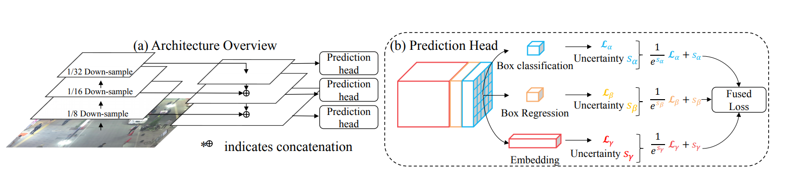

# Object tracking

# 성능지표

- MOTA (%)
- IDF1

# 예시

---

> 2D Multi-object tracking(MOT) by single camera 에 대한 내용을 다룬다.
> 

# Introduction

- Trajectory: 객체의 전체 구간 경로
- Tracklet: 짧은 구간에서의 경로

## Object detection vs. Object tracking

- Object detection: 영상에 있는 객체들의 바운딩 박스를 검출
- Object tracking: 같은 클래스 내의 객체들을 구별하기 위해 각 박스마다 고유의 ID를 연결(association)

## Multi-object tracking (MOT) challenging point

- Various occlusion
- interactions between objects (ID switch)

# Object tracking metrics

## Classical metrics

- Mostly Tracked (**MT**) trajectories
    - 적어도 80% 프레임 이상 정답 trajectory와 일치한 trajectory 수
- Fragments
    - trajectory hypotheses which cover at most 80% of a ground truth trajectory.
    - true trajectory can be covered by more than one fragment
- Mostly Lost (**ML**) trajectories
    - 적어도 20% 프레임 이하로 정답 trajectory와 일치하지 않은 trajectory 수
- False trajectories
    - 실제 객체와 일치하지 않은 예측된 trajectory
- ID switches
    - 객체가 올바르게 추적되었지만 연결된 ID가 잘못 변경된 횟수

## CLEAR MOT [[2](about:blank#)]

- FP
    - 동영상 전체에서 false postive 수
- FN
    - 동영상 전체에서 false negative 수
- Fragm
    - 총 fragmentation 수
    - fragmentation : 추적이 중단되었다가 다시 재개되는 경우
- IDSW
    - 총 ID switch 가 일어난 횟수
- MOTA (Multiple Object Tracking Accuracy)

$$
MOTA = 1 - {{(FN + FP +IDSW)}\over{GT}}\in[-\infin,1]
$$

## ID scores [[3](about:blank#)]

- Identification precision :

$$
IDP = {{IDTP}\over{IDTP + IDFP}}
$$

- Identification recall :

$$
IDR = {{IDTP}\over{IDTP +IDFN}}
$$

- Identification F1 :

$$
IDF1 = {{2}\over{{1}\over{IDP}} +{{1}\over{IDR}}} = {{2IDTP}\over{2IDTP +IDFP + IDFN}}
$$

# MOT algorithms

## Batch tracking vs. Online tracking

- Batch tracking (offline tracking)
    - 과거, 현재, 미래의 모든 정보를 사용하여 객체를 추적하는 방법
    - 수행 단위 → 비디오 전체
- Online tracking
    - 과거, 현재의 정보만을 이용하여 객체를 추적하는 방법
    - Real-time 가능
    - 수행 단위 → 프레임

Online 방법이 상대적으로 batch 방법에 비해 상대적으로 성능은 낮음

Online 방법이 real-time이 가능하나 계산량이 많고 여전히 느린 경우가 많다

## Tracking-by-detection

- MOT 방법 중 가장 대표적인 방법
- 개별 프레임 단위로 object detection을 수행
- Detection 결과로 각 instance에 대한 정보를 object tracker가 관리
- 새로운 프레임이 들어오면 detection을 다시 수행하고 tracker가 관리하고 있던 이전 정보와 새로운 정보간의 data association을 측정하여 동일한 대상에 동일한 ID를 할당

→ 최근 detection 알고리즘 성능이 발전함에 따라 많은 MOT 연구들이 association의 성능을 높이는데 집중하는 경향이 있음

## One shot MOT

- Detection과 tracking을 동시에 수행

# Usual workflow of a MOT algorithm

### 1. Detection stage

### 2. Feature extraction/ motion prediction stage

- 검출된 객체 혹은 tracklet을 분석하여 appearance, motion, interaction 등의 특징들을 추출

### 3. Affinity stage

- 특징 및 모션 예측을 사용하여 검출된 객체 혹은 tracklet 쌍 간의 similarity/ distance score를 계산

### 4. Association stage

- similarity/distance score 를 통해 동일한 대상에 속하는 객체 및 tracklet 을 연결

# Deep learning in MOT

## 1. DL in detection step

Detection의 성능을 향상시켜 전반적으로 tracking의 성능을 향상시킴

Deep learning을 이용한 detection 모델을 사용하여 detection 진행

- Faster R-CNN
    - SORT ('16) [[4](about:blank#Reference)]
        - Detector: Faster R-CNN으로 object 바운딩 박스 검출
        - Tracker: Kalman filter + Hungarian algorithm
    - POI ('16) [[5](about:blank#Reference)]
- SSD
- YOLO

등등

## 2. DL in feature extraction and motion prediction

Deep learning을 이용하여 풍부하고 의미있는 high-level feature들을 추출할 수 있음

일반적으로 CNN을 이용하여 visual feature를 추출

각 대상들 사이의 차이점을 잘 구별하는 feature들을 추출하기 위해 siamese 네트워크 구조를 사용하기도 함

### 1 ) CNNs as visual feature extractor

- Kim et al ('15) [[7](about:blank#Reference)]
    - detection에서 pretrained 된 CNN의 4096 차원 visual feature를 PCA를 이용하여 256차원으로 축소
    - CNN으로 추출된 visual feature를 고전적인 Multiple Hypothesis Tracking (MHT) 알고리즘에 적용
- **DeepSORT** ('17) [[6](about:blank#Reference)]
    - residual CNN을 이용하여 128차원의 정규화 된 visual feature 를 추출
    - feature vector들의 cosine distance를 통해 affinity score를 구함
    - hungarian algorithm을 통해 association

### SORT ('16) vs. DeepSORT ('17)

### SORT

- Faster-RCNN 모델을 이용해 object detection을 수행하고 bounding box 정보를 얻음
- Kalman 필터를 통해 기존의 Track 정보로부터 다음 frame의 물체의 위치를 예측
- detection 결과와 prediction 결과의 IoU distance를 통해 hungarian algorithm으로 association

→ Kalman 필터의 단점

- Occlusion, 다른 view point에 취약
- ID switching에 불안정

### DeepSORT

위와 같은 SORT의 단점을 DeepSORT는 appearance 정보를 통해서 해결함

- YOLO 모델을 이용해 object detection 수행 및 bounding box 정보 얻음
- Kalman 필터를 통해 다음 frame 물체의 위치 예측
- **Matching Cascade**
     

        
        CNN 기반의 Re-ID 모델을 이용해 visual feature 추출
        
    - motion에 관련된 kalman filter feature 들의 mahalanobis distance와 CNN으로 추출된 visual feature 들의 cosine distance의 가중평균 합으로 cost matrix 구함
    - Hungarian Algorithm으로 association

### 2 ) Siamese network

서로 다른 객체들을 잘 구별하는 feature를 얻기 위해 서로 다른 이미지의 정보를 결합하는 손실함수로 CNN을 훈련

Siamese network 구조를 통한 metric learning

- DCCRF ('18) [[8](about:blank#Reference)]
- pyramid siamese network ('18) [[9](about:blank#Reference)]

### 3) LSTM

- detection 단계에서 추출된 feature를 입력으로 받아 association feature를 추출하기도 함
- motion prediction을 위해 LSTM을 통해 feature를 추출하기도 함

## 3. DL in affinity computation

일반적으로 CNN으로 추출된 feature들을 특정 거리함수(e.g. euclidean distance, cosine distance)로 affinity score를 계산하지만 deep learning  모델을 사용하여 affinity score를 구하는 연구도 진행됨

### LSTM

- LSTM
- Siamese LSTM
- Bidirectional LSTM
    - DMAN ('18) [[10](about:blank#Reference)]
- LSTM in Multiple Hypothesis Tracking Framework

### CNN

- visual-similarity CNN
    - DCCRF ('18) [[8](about:blank#Reference)]
- Siamese CNN
    - customized multi-person tracker ('18) [[11](about:blank#Reference)]
    - pyramid siamese network ('18) [[9](about:blank#Reference)]

|Model|Detection|Feature extr. / mot. pred.|Affinity / cost computation|Association / Tracking|Mode|Sorce and data|
|---|---|---|---|---|---|---|
|SORT ('16)[[6]](about:blank#Reference)|Faster R-CNN|Kalman filter|IoU|Hungarian|online|[code]|
|POI ('16) [[5]](about:blank#Reference)|Modified Faster R-CNN|Modified GoogLeNet Kalman filter|Cosine distance + IoU|Hungarian (online) modified H2T(batch)|online + batch|[code]|
|DeepSORT ('17) [[6]](about:blank#Reference)|From POI[[5]](about:blank#Reference)|Kalman filter Wide Residual Net|Mahalanobis dist.(mot) + cosine distance(app.) IoU|Hungarian|online|[code]|
|DCCRF ('18) [[8]](about:blank#Reference)|Public (dataset에서 제공)|DCCRF, visual-displacement CNN|Visual-similarity CNN IoU|Hungarian|online|X|
|pyramid siamese network ('18) [[9]](about:blank#Reference)|Public|Feature Pyramid Siamese Network,  motion features|Feature Pyramid Siamese Network|Custom greedy algorithm|online|X|
|DMAN ('18) [[10]](about:blank#Reference)|Public|Linear motion model Spatial Attention Network CNN|Temporal Attention Network (bidirectional LSTM)|Custom greedy algorithm, ECO (single object tracker)|online|[code]|
|customized multi-person tracker ('18) [[11]](about:blank#Reference)|Public|DeepMatching, Siamese CNN|Edge potential as in [[12]](about:blank#Reference), Siamese CNN|Lifted multicut|batch|X|

# One Shot MOT

(a), (b) 는 Tracking by detection 전략의 2-stage tracker

이러한 방식은 detection  정보를 기반으로 tracking을 수행하기 때문에 느리다는 한계가 있음

JDE 와 같은 One Shot MOT는 detection과 tracking을 동시에 수행하여 이러한 한계를 해결하고자 함

## Multi-Task Deep Learning

- 같은 domain에서 여러 task를 동시에 수행하는 deep learning 방식
- One Shot MOT는 multi-task deep learning이라고 볼 수 있음
    - detection + tracking

## JDE ('20) [[13](about:blank#Reference)]

- FPN (Feature Pyramid Network) → feature extractor 역할
- Prediction Head → 추출된 feature 기반으로 각 task를 수행하는 역할
- triplet loss 를 이용한 metric learning
- association → Hungarian algorithm

→ 속도는 빠르지만, 다른 tracking by detection 전략을 갖는 모델에 비해 낮은 정확도

## Fair MOT ('21) [[15](about:blank#Reference)]

JDE의 빠른 속도에 비해 낮은 정확도 문제를 개선

Architecture의 전반적인 구조와 비슷하지만 아래와 같은 차이점이 있음

1. Anchor Free with Point Detection
2. Hourglass structure
3. 그 외의 디테일 테크닉

### Anchor Free with Key Point Detection

그림 (a)

- 두 상자는 anchor box → 하나의 인스턴스를 가리킴에도 crop 한 이미지는 서로 굉장히 다른 양상을 보임
- 이를 기반으로 추출한 feature들도 굉장히 다른 양상을 보임
- Anchor-based 방법은 오히려 tracker의 성능을 떨어뜨린다고 판단

그림 (b)

- Anchor free 방법을 도입함으로써 object 중심에 box center를 둠으로써 정확한 Re-ID feature를 추출
- Anchor free 방법은 heat map과 offset을 예측하기 때문에 box regression이후 NMS등의 후처리가 불필요

### Hourglass Structure

- key point detection이 핵심인 pose estimation 분야에서 검증된[[16](about:blank#Reference)] hourglass 구조를 채용

---

# Methods

- Sort ('16) [[4](about:blank#Reference)]
- POI ('16) [[5](about:blank#Reference)]
- DeepSort ('17) [[6](about:blank#Reference)]
- DMAN ('18) [[10](about:blank#Reference)]

# State-of-the-Art

- JDE ('20) [[13](about:blank#Reference)] [[code](https://github.com/Zhongdao/Towards-Realtime-MOT)]
- Fair MOT ('21) [[15](about:blank#Reference)] [[code](https://github.com/ifzhang/FairMOT)]
- ByteTrack ('21) [[17](about:blank#Reference)] [[code](https://github.com/ifzhang/ByteTrack)]

---

# Reference

[1] *Ciaparrone, Gioele, et al. "Deep learning in video multi-object tracking: A survey." Neurocomputing 381: 61-88, 2020. [[link](https://www.sciencedirect.com/science/article/pii/S0925231219315966?casa_token=aHkNS6MFAk8AAAAA:FrZhsaAD1HnPdkZZ6mrTcHq3seV5WyY1D23VESaS2-3GVzPEw3UrJiWoe26rRVqcT3P6GdPQ)]*

[2] *Bernardin, Keni, and Rainer Stiefelhagen. "Evaluating multiple object tracking performance: the clear mot metrics." EURASIP Journal on Image and Video Processing 2008: 1-10, 2008. [[link](https://scholar.google.co.kr/scholar?hl=ko&as_sdt=0%2C5&q=Evaluating+multiple+object+tracking+performance%3A+the+clear+mot+metrics.&btnG=)]*

[3] *Ristani, Ergys, et al. "Performance measures and a data set for multi-target, multi-camera tracking." European conference on computer vision. Springer, Cham, 2016. [[link](https://link.springer.com/chapter/10.1007/978-3-319-48881-3_2)]*

[4] *Bewley, Alex, et al. "Simple online and realtime tracking." 2016 IEEE international conference on image processing (ICIP). IEEE, 2016. [[link](https://ieeexplore.ieee.org/abstract/document/7533003?casa_token=p9sWs2QKqcsAAAAA:nzlZPHy7t5bW9akeK9UuX_zQlCg0KbaBkVrt20QIwMd_oxteADaaIdQBJHkJ31puPOUh8eg)][[code](https://github.com/abewley/sort)]*

[5] *Yu, Fengwei, et al. "Poi: Multiple object tracking with high performance detection and appearance feature." European Conference on Computer Vision. Springer, Cham, 2016. [[link](https://scholar.google.co.kr/scholar?hl=ko&as_sdt=0%2C5&q=Poi%3A+Multiple+object+tracking+with+high+performance+detection+and+appearance+feature.&btnG=)][[code](https://drive.google.com/file/d/0B5ACiy41McAHMjczS2p0dFg3emM/view)]*

[6] *Wojke, Nicolai, Alex Bewley, and Dietrich Paulus. "Simple online and realtime tracking with a deep association metric." 2017 IEEE international conference on image processing (ICIP). IEEE, 2017. [[link](https://ieeexplore.ieee.org/abstract/document/8296962?casa_token=edaO2S52z00AAAAA:CI8JyoCAMz_8I5I-jqt06hqvDwEa6aOW7RX7WH6vKMGDXCTG5uKReib5fknT4Rvg6etZKDQ)][[code](https://github.com/nwojke/deep_sort)]*

[7] *Kim, Chanho, et al. "Multiple hypothesis tracking revisited." Proceedings of the IEEE international conference on computer vision. 2015. [[link](https://www.cv-foundation.org/openaccess/content_iccv_2015/html/Kim_Multiple_Hypothesis_Tracking_ICCV_2015_paper.html)]*

[8] *Zhou, Hui, et al. "Deep continuous conditional random fields with asymmetric inter-object constraints for online multi-object tracking." IEEE Transactions on Circuits and Systems for Video Technology 29.4 : 1011-1022, 2018. [[link](https://ieeexplore.ieee.org/abstract/document/8335792?casa_token=i6QUjWG-RpQAAAAA:ETuulAFtEpZ1nOR6vq3AkXy4HCY7C0OfwIKJzN5Z2yZoCcs2BZBJJPD-MxCFgSG47wO7kBs)]*

[9] *Lee, Sangyun, and Euntai Kim. "Multiple object tracking via feature pyramid siamese networks." IEEE access 7 : 8181-8194, 2018. [[link](https://ieeexplore.ieee.org/abstract/document/8587153)]*

[10] *Zhu, Ji, et al. "Online multi-object tracking with dual matching attention networks." Proceedings of the European conference on computer vision (ECCV). 2018. [[link](https://openaccess.thecvf.com/content_ECCV_2018/html/Ji_Zhu_Online_Multi-Object_Tracking_ECCV_2018_paper.html)][[code](https://github.com/jizhu1023/DMAN_MOT)]*

[11] *Ma, Liqian, et al. "Customized multi-person tracker." Asian conference on computer vision. Springer, Cham, 2018. [[link](https://link.springer.com/chapter/10.1007/978-3-030-20890-5_39)]*

[12] *Tang, Siyu, et al. "Multi-person tracking by multicut and deep matching." European Conference on Computer Vision. Springer, Cham, 2016. [[link](https://link.springer.com/chapter/10.1007/978-3-319-48881-3_8)]*

[13] *Wang, Zhongdao, et al. "Towards real-time multi-object tracking." European Conference on Computer Vision. Springer, Cham, 2020. [[link](https://link.springer.com/chapter/10.1007/978-3-030-58621-8_7)][[code](https://github.com/Zhongdao/Towards-Realtime-MOT)]*

[14] *Rebuffi, Sylvestre-Alvise, Hakan Bilen, and Andrea Vedaldi. "Efficient parametrization of multi-domain deep neural networks." Proceedings of the IEEE Conference on Computer Vision and Pattern Recognition. 2018. [[link](https://openaccess.thecvf.com/content_cvpr_2018/html/Rebuffi_Efficient_Parametrization_of_CVPR_2018_paper.html)]*

[15] *Zhang, Yifu, et al. "Fairmot: On the fairness of detection and re-identification in multiple object tracking." International Journal of Computer Vision 129.11 : 3069-3087, 20201. [[link](https://link.springer.com/article/10.1007/s11263-021-01513-4)][[code](https://github.com/ifzhang/FairMOT)]*

[16] *Newell, Alejandro, Kaiyu Yang, and Jia Deng. "Stacked hourglass networks for human pose estimation." European conference on computer vision. Springer, Cham, 2016. [[link](https://link.springer.com/chapter/10.1007/978-3-319-46484-8_29)]*

[17] *Zhang, Yifu, et al. "ByteTrack: Multi-Object Tracking by Associating Every Detection Box." arXiv preprint arXiv:2110.06864, 2021. [[link](https://arxiv.org/abs/2110.06864)][[code](https://github.com/ifzhang/ByteTrack)]*